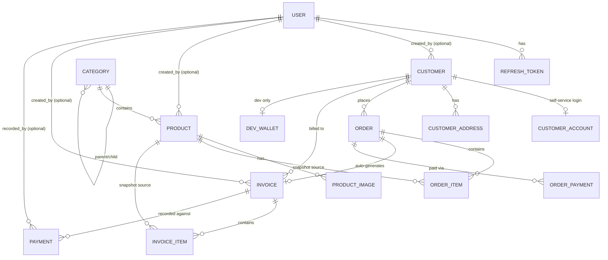

# Core API Data Model

Drafted 2026-07-30. Companion to `ANGKOR_COMMERCE_PROJECT_PROPOSAL.md` Section 17 — this doc is the
entity-level breakdown for building `apps/core-api` out to actually serve both `apps/back-office-portal`
(staff) and `apps/customer-portal` (storefront, currently 100% mock/localStorage).

Status legend:

- ✅ **Real** — entity + repository + endpoint(s) implemented and working today.
- 🧱 **Schema only** — table exists in a Flyway migration, but no Java entity/repository/controller yet.
- 🚧 **Scaffolded** — Java files exist (package, empty class) but contain zero fields/logic.
- 🆕 **Net new** — nothing exists yet, not even a table.

Verified directly against `apps/core-api/src/main/resources/db/migration/{V1,V2}__*.sql` and the Java
source tree on 2026-07-30, not just the proposal doc — the SQL is considerably ahead of the Java layer
in several places.

---

## 1. Identity & access — staff side

Already real; listed for completeness of the full picture.

| Entity | Status | Notes |
|---|---|---|
| `User` | ✅ | `id, firstName, lastName, username, email, phone, passwordHash, image, role, status, createdAt, updatedAt, createdBy, updatedBy`. Role is a bounded string enum column, not a join table (single role per user today). |
| `Role` | ✅ | `SUPER_ADMIN`, `SHOP_ADMIN`, `STAFF`. |
| `RefreshToken` | ✅ | `id, userId, tokenHash, expiresAt, revoked, createdAt`. Backs `/api/v1/auth/refresh`. |

## 2. Identity & access — customer/storefront side

| Entity | Status | Notes |
|---|---|---|
| `Customer` | ✅ (partial) | Real entity + `Customer(customerType, firstName, lastName, companyName, email, phone)`. Proposal flags: no create/update endpoint yet (`list`/`get` only), **no unique constraint on `email`**. |
| `CustomerAccount` | 🧱 | Table `customer_accounts` already exists: `id, customerId (1:1, unique), email, passwordHash, recordStatus, lastLoginAt, timestamps`. This is the self-service login the proposal (§17.2) originally sketched as *nullable `passwordHash`/`emailVerified` columns on `Customer`* — the migration already picked the cleaner design (separate table) instead. No Java entity yet. **`emailVerified` from §17.2 has no column anywhere yet** — needs adding here if pursued. |
| `CustomerAddress` | 🧱 | Table exists: `id, customerId, addressType (BILLING/SHIPPING/OTHER), addressLine, city, province, postalCode, country, isPrimary, timestamps`. No Java entity yet. **Shape mismatch to flag**: `customer-portal`'s mock `ShippingAddress` type is `{fullName, phone, address, city, postalCode?, notes?}` — no `fullName`/`notes`/`province` columns here, no `country` in the frontend type. Needs reconciling before wiring the real thing (see open questions). |

## 3. Catalog

| Entity | Status | Notes |
|---|---|---|
| `Category` | ✅ | Implemented 2026-07-30: entity, repository, service, `CategoryResponse`/`CreateCategoryRequest`/`UpdateCategoryRequest`, `CategoryController` at `GET/POST/PUT/DELETE /api/v1/categories`. `GET` is public (no auth) for both back-office and the future storefront; writes require `SUPER_ADMIN`/`SHOP_ADMIN` (see `SecurityConfig`). Returns a flat active list — client builds the parent/child tree, same as `customer-portal`'s mock `category-helpers.ts` does today. Soft-delete via `DELETE` sets `recordStatus = DELETED`. No deep cycle-detection on `parentId` updates (only rejects a category being its own direct parent) — acceptable for this size of tree. |
| `Product` | 🧱🚧 | Table exists: `id, title, description, categoryId, price, currency, discountPercentage, rating, stock, sku, unit, thumbnailUrl, recordStatus, createdByUserId, timestamps`. Java `product/` module exists but every file (`Product`, `ProductController`, `ProductRepository`, `ProductService`, impl) is a 0-byte scaffold. |
| `ProductImage` | 🧱 | Table exists: `id, productId, imageUrl, displayOrder, timestamps`, unique on `(productId, displayOrder)`. No Java entity. |

## 4. Commerce — storefront orders (net new, per §17.3)

| Entity | Status | Notes |
|---|---|---|
| `Order` | 🆕 | No table yet. Proposal: `status` (`PENDING → INVOICED` or `→ CANCELLED`), belongs to a `Customer`. Needs: `orderNumber`, shipping address (own columns or FK to `customer_addresses` — see open questions), `subtotal`, `shippingFee`, `total`, `currency`, `placedAt`, timestamps. The `order/` Java module exists but is entirely 0-byte scaffolds. |
| `OrderItem` | 🆕 | No table yet. Per §17.3, needs a `unitPriceSnapshot` per line (mirrors `invoice_items`' existing snapshot pattern) so later `Product` price edits never retroactively change a placed order. Also snapshot `title`/`sku` the same way `invoice_items` already does. |

This is the biggest actual gap: **there is no `orders`/`order_items` table in any migration today.** The
SQL schema currently jumps straight to `invoices` — it was built for the back-office (staff manually
raises an invoice), not for a customer-initiated checkout flow.

## 5. Billing — invoices (back-office, existing schema)

| Entity | Status | Notes |
|---|---|---|
| `Invoice` | 🧱🚧 | Table exists (very fleshed out): status lifecycle `DRAFT → ISSUED → PARTIALLY_PAID/PAID/OVERDUE/CANCELLED`, subtotal/discount/tax/total/paidAmount/balance with a `CHECK (balance = total - paid_amount)` constraint, `totalItems`/`totalQuantity` denormalized counts. Java module 0-byte scaffolds throughout. **No `order_id` FK yet** — needed for §17.3's "Invoice gets an order FK, kept nullable so staff can still raise a manual invoice with no order behind it." |
| `InvoiceItem` | 🧱 | Table exists, deliberately a line-item *snapshot* (title/sku/description/thumbnail/price captured at invoice time, `product_id` nullable + `ON DELETE SET NULL` so deleting a product doesn't break historical invoices). No Java entity. |

## 6. Payments — two distinct concepts, don't conflate them

| Entity | Status | Notes |
|---|---|---|
| `Payment` (back-office) | 🧱🚧 | Existing table `payments`: staff **manually records** how an invoice got paid — `paymentMethod` (`CASH/BANK_TRANSFER/QR_CODE/CARD/OTHER`), `paymentStatus` (`COMPLETED/VOIDED/REFUNDED`), `paymentDate` (a `DATE`, not a timestamp — it's a bookkeeping entry, not a live transaction). No provider tracking, no pending/webhook lifecycle — it's not built for that. Java module 0-byte scaffolds. |
| `OrderPayment` (storefront) | 🆕 | **New concept**, not the same table as above. This is the `PaymentMethod`/`PaymentProvider`/`PaymentStatus` design from `CORE_API_PAYMENTS.md`: `DEV_WALLET`/`KHQR` methods, `INTERNAL`/`ABA_PAYWAY` providers, richer status (`PENDING/PAID/FAILED/CANCELLED/EXPIRED/REFUNDED`), `providerTransactionId`, `providerReference`, `expiresAt` for the async KHQR flow. Attaches to `Order`, not `Invoice` — the payment happens at customer checkout, before/as the invoice gets generated. See [`CORE_API_PAYMENTS.md`](./CORE_API_PAYMENTS.md) for the processor architecture (`PaymentProcessor` / `PaymentProcessorRegistry`). |
| `DevWallet` | 🆕 | Dev/test-only fake balance ledger: `customerId (1:1), balance, currency, timestamps`. Gated by both a config flag and a Spring `@Profile` restriction so it can never activate in production. |

**Recommendation**: keep these as two separate tables/entities. `payments` is staff bookkeeping against
an `Invoice`; the new online-payment table is customer-initiated against an `Order` and has a
fundamentally different lifecycle (pending → async provider confirmation vs. instantaneous manual entry).
Forcing them into one table would mean nullable columns everywhere and lifecycle checks that don't apply
to half the rows.

## 7. Audit

| Entity | Status | Notes |
|---|---|---|
| `AuditLog` | 🧱 | Table exists: `actorUserId, action, entityType, entityId, description, oldValues/newValues (jsonb), ipAddress, userAgent, requestId, createdAt`. No entity, no write path from anywhere yet — every module above will eventually need to write to this on create/update/delete of anything customer-facing or financial. |

---

## 8. Entity relationship overview

---

## 9. Design decisions

Resolved 2026-07-30 (previously listed as open questions).

1. **Cart persistence: client-only, decided.** No server-side `Cart` entity. `Order` is created only at checkout, exactly as `customer-portal` already does today with its localStorage cart.
2. **Address shape: extend the table, decided.** `customer_addresses` gets `full_name`, `phone`, and `notes` columns added (migration not yet written) to match `customer-portal`'s existing `ShippingAddress` type, rather than reworking the already-built frontend to the current DB shape. `province`/`country`/`isPrimary` stay as-is on the table; the frontend type just doesn't use them yet.
3. **Saved payment methods: hide in frontend first, decided.** Rather than ripping the feature out immediately, plan is to hide the "add/edit saved card" UI in `customer-portal` first (stop surfacing it), and only fully remove/repurpose it once the real `DEV_WALLET`/`KHQR` checkout replaces it end-to-end. Not scheduled yet — noted here so it isn't forgotten when payment work starts.
4. **`Order` → `Invoice` snapshotting: confirmed.** `InvoiceItem` rows generated from an order-backed invoice snapshot fields from `OrderItem` (not a live reference), consistent with how `invoice_items` already snapshot from `products` today.
5. **`emailVerified`: add nullable, unenforced, decided.** When `customer_accounts.email_verified` gets added, it's nullable/boolean-default-false with no enforcement anywhere yet — registration and checkout both ignore it for now. Revisit enforcement later.
6. **Favorites/wishlist: confirmed, low priority.** `customer_favorites (customer_id, product_id)` join table, whenever it's worth doing — not scheduled.
7. **Storefront auth stays a separate identity/security chain from staff — this is not multi-tenancy.** Multi-tenancy would mean multiple independent stores sharing one deployment (Store A's staff can't see Store B's data) — that's explicitly out of scope; this is a single mini-store. The staff/customer split exists for a different reason: staff auth is role-based ("can this role touch any invoice"), customer auth is ownership-based ("can this specific customer touch only their own order/invoice"). Merging them into one `SecurityFilterChain` wouldn't reduce complexity — every staff rule would need to additionally exclude customer principals and vice versa. Splitting by path prefix (`/api/v1/storefront/**` vs everything else) makes it structurally impossible for a customer token to even reach a staff-only rule, rather than relying on every individual rule to get the exclusion right. `Customer` does not get a `Role` value for the same reason §17.2 already gives: inventing a fake `CUSTOMER` role would pollute an enum that's meant to represent staff permission levels, not just "is logged in."
8. **`Customer.customerType` (`INDIVIDUAL`/`BUSINESS`) stays back-office-only, decided.** The storefront registration DTO (`POST /storefront/auth/register`) does not expose or ask for `customerType` at all — self-registered customers are always created as `INDIVIDUAL` server-side. The column/CHECK constraint stays on `Customer` because staff still need `BUSINESS` when manually raising an invoice for a business client through the back-office — that's a staff-only path, unaffected by this.

---

See also: [`CORE_API_ENDPOINTS.md`](./CORE_API_ENDPOINTS.md) for the REST contract these entities are exposed through, and [`CORE_API_PAYMENTS.md`](./CORE_API_PAYMENTS.md) for the payment processor design.
