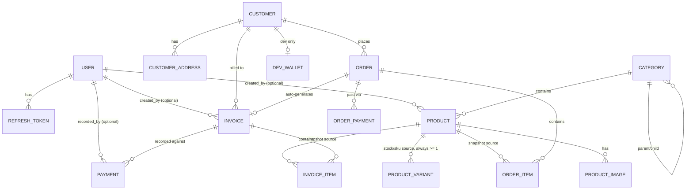

# Core API Data Model

Drafted 2026-07-30. Companion to `ANGKOR_COMMERCE_PROJECT_PROPOSAL.md` — this doc is the
entity-level breakdown for building `apps/core-api` out to actually serve both `apps/back-office-portal`
(staff) and `apps/customer-portal` (storefront, currently 100% mock/localStorage).

Status legend:

- ✅ **Real** — entity + repository + endpoint(s) implemented and working today.
- 🧱 **Schema only** — table exists in a Flyway migration, but no Java entity/repository/controller yet.
- 🚧 **Scaffolded** — Java files exist (package, empty class) but contain zero fields/logic.
- 🆕 **Net new** — nothing exists yet, not even a table.

Verified directly against `apps/core-api/src/main/resources/db/migration/{V1,V2}__*.sql` and the Java
source tree on 2026-07-30, not just the proposal doc — the SQL is considerably ahead of the Java layer
in several places.

---

## 1. Identity & access — staff side

Already real; listed for completeness of the full picture.

| Entity         | Status | Notes                                                                                                                                                                                                                  |
| -------------- | ------ | ---------------------------------------------------------------------------------------------------------------------------------------------------------------------------------------------------------------------- |
| `User`         | ✅     | `id, firstName, lastName, username, email, phone, passwordHash, image, role, status, createdAt, updatedAt, createdBy, updatedBy`. Role is a bounded string enum column, not a join table (single role per user today). |
| `Role`         | ✅     | `SUPER_ADMIN`, `SHOP_ADMIN`, `STAFF`.                                                                                                                                                                                  |
| `RefreshToken` | ✅     | `id, userId, tokenHash, expiresAt, revoked, createdAt`. Backs `/api/v1/auth/refresh`.                                                                                                                                  |

## 2. Identity & access — customer/storefront side

| Entity            | Status       | Notes                                                                                                                                                                                                                                                                                                                                                                                                                                                                                                                                                                                                                                             |
| ----------------- | ------------ | ------------------------------------------------------------------------------------------------------------------------------------------------------------------------------------------------------------------------------------------------------------------------------------------------------------------------------------------------------------------------------------------------------------------------------------------------------------------------------------------------------------------------------------------------------------------------------------------------------------------------------------------------- |
| `Customer`        | ✅ (partial) | Real entity, merged with login credentials as of 2026-07-31 (decision 10 below): `Customer(firstName, lastName, companyName, email, passwordHash, phone)`, plus `recordStatus`/`lastLoginAt`. `customerType`/`INDIVIDUAL`/`BUSINESS` removed entirely as of decision 11 (below) — no distinction between individual and business customers anymore. `email` is `NOT NULL` + unique (`uq_customers_email_lower`). No separate `CustomerAccount`/`customer_accounts` table anymore — every `Customer` row _is_ a storefront login. Proposal flags: no create/update endpoint yet (`list`/`get` only) — and per decision 10, staying that way; only `POST /storefront/auth/register` creates rows. **`emailVerified` (decision 5 below) has no column anywhere yet** — needs adding here if pursued. |
| `CustomerAddress` | ✅           | Rebuilt by `V5__add_customer_addresses.sql` (superseding the original table and open question 2 below): `id, customerId, label, recipientName, recipientPhone, line1, line2, commune, district, province, postalCode, country, isDefault, status, timestamps`, plus `latitude`/`longitude` from `V10__add_customer_address_coordinates.sql`. Entity, repository, service, mapper and `CustomerAddressController` at `/storefront/addresses` all exist. Cambodian addressing rather than the frontend's old flat `{address, city}` mock: `commune` is the sangkat/khum, `district` the khan/srok, `province` the capital/khaet. At most 3 active rows per customer (service rule); exactly one default (partial unique index); delete is a soft `status = DELETED` that promotes the oldest remaining address. Coordinates are nullable and stored as a pair (`NUMERIC(9,6)`, ~11 cm), set from the storefront's map picker. |

## 3. CatalogZ

| Entity           | Status | Notes                                                                                                                                                                                                                                                                                                                                                                                                                                                                                                                                                                                                                                                                       |
| ---------------- | ------ | --------------------------------------------------------------------------------------------------------------------------------------------------------------------------------------------------------------------------------------------------------------------------------------------------------------------------------------------------------------------------------------------------------------------------------------------------------------------------------------------------------------------------------------------------------------------------------------------------------------------------------------------------------------------------- |
| `Category`       | ✅     | Implemented 2026-07-30: entity, repository, service, `CategoryResponse`/`CreateCategoryRequest`/`UpdateCategoryRequest`, `CategoryController` at `GET/POST/PUT/DELETE /api/v1/categories`. `GET` is public (no auth) for both back-office and the future storefront; writes require `SUPER_ADMIN`/`SHOP_ADMIN` (see `SecurityConfig`). Returns a flat active list — client builds the parent/child tree, same as `customer-portal`'s mock `category-helpers.ts` does today. Soft-delete via `DELETE` sets `recordStatus = DELETED`. No deep cycle-detection on `parentId` updates (only rejects a category being its own direct parent) — acceptable for this size of tree. |
| `Product`        | 🧱🚧   | Table exists: `id, title, description, categoryId, price, currency, discountPercentage, rating, unit, thumbnailUrl, recordStatus, createdByUserId, timestamps`. **No `stock`/`sku` here as of decision 9 (revised) below** — every product has ≥1 `ProductVariant` row instead, so stock/sku are read from there unconditionally. Java `product/` module exists but every file (`Product`, `ProductController`, `ProductRepository`, `ProductService`, impl) is a 0-byte scaffold. |
| `ProductVariant` | 🧱     | Table exists as of 2026-07-31 (decision 9, revised): `id, productId, size (nullable), sku, stock, priceOverride (nullable), timestamps`. Unique on `sku`; at most one row per `(productId, size)` when `size` is set, and at most one `size IS NULL` row per product (two partial unique indexes, since plain `UNIQUE(productId, size)` would let multiple `NULL`-size rows through). No Java entity yet. |
| `ProductImage`   | 🧱     | Table exists: `id, productId, imageUrl, displayOrder, timestamps`, unique on `(productId, displayOrder)`. No Java entity.                                                                                                                                                                                                                                                                                                                                                                                                                                                                                                                                                   |

## 4. Commerce — storefront orders (net new)

| Entity      | Status | Notes                                                                                                                                                                                                                                                                                                                                                 |
| ----------- | ------ | ----------------------------------------------------------------------------------------------------------------------------------------------------------------------------------------------------------------------------------------------------------------------------------------------------------------------------------------------------- |
| `Order`     | 🆕     | No table yet. Proposal: `status` (`PENDING → INVOICED` or `→ CANCELLED`), belongs to a `Customer`. Needs: `orderNumber`, shipping address (own columns or FK to `customer_addresses` — see open questions), `subtotal`, `shippingFee`, `total`, `currency`, `placedAt`, timestamps. The `order/` Java module exists but is entirely 0-byte scaffolds. |
| `OrderItem` | 🆕     | No table yet. Per decision 4 below, needs a `unitPriceSnapshot` per line (mirrors `invoice_items`' existing snapshot pattern) so later `Product` price edits never retroactively change a placed order. Also snapshot `title`/`sku` the same way `invoice_items` already does.                                                                                   |

This is the biggest actual gap: **there is no `orders`/`order_items` table in any migration today.** The
SQL schema currently jumps straight to `invoices` — it was built for the back-office (staff manually
raises an invoice), not for a customer-initiated checkout flow.

## 5. Billing — invoices (back-office, existing schema)

| Entity        | Status | Notes                                                                                                                                                                                                                                                                                                                                                                                                                                                                       |
| ------------- | ------ | --------------------------------------------------------------------------------------------------------------------------------------------------------------------------------------------------------------------------------------------------------------------------------------------------------------------------------------------------------------------------------------------------------------------------------------------------------------------------- |
| `Invoice`     | 🧱🚧   | Table exists (very fleshed out): status lifecycle `DRAFT → ISSUED → PARTIALLY_PAID/PAID/OVERDUE/CANCELLED`, subtotal/discount/tax/total/paidAmount/balance with a `CHECK (balance = total - paid_amount)` constraint, `totalItems`/`totalQuantity` denormalized counts. Java module 0-byte scaffolds throughout. **No `order_id` FK yet** — needed for decision 4 below's "Invoice gets an order FK, kept nullable so staff can still raise a manual invoice with no order behind it." |
| `InvoiceItem` | 🧱     | Table exists, deliberately a line-item _snapshot_ (title/sku/description/thumbnail/price captured at invoice time, `product_id` nullable + `ON DELETE SET NULL` so deleting a product doesn't break historical invoices). No Java entity.                                                                                                                                                                                                                                   |

## 6. Payments — two distinct concepts, don't conflate them

| Entity                      | Status | Notes                                                                                                                                                                                                                                                                                                                                                                                                                                                                                                                                                                                                                            |
| --------------------------- | ------ | -------------------------------------------------------------------------------------------------------------------------------------------------------------------------------------------------------------------------------------------------------------------------------------------------------------------------------------------------------------------------------------------------------------------------------------------------------------------------------------------------------------------------------------------------------------------------------------------------------------------------------- |
| `Payment` (back-office)     | 🧱🚧   | Existing table `payments`: staff **manually records** how an invoice got paid — `paymentMethod` (`CASH/BANK_TRANSFER/QR_CODE/CARD/OTHER`), `paymentStatus` (`COMPLETED/VOIDED/REFUNDED`), `paymentDate` (a `DATE`, not a timestamp — it's a bookkeeping entry, not a live transaction). No provider tracking, no pending/webhook lifecycle — it's not built for that. Java module 0-byte scaffolds.                                                                                                                                                                                                                              |
| `OrderPayment` (storefront) | 🆕     | **New concept**, not the same table as above. This is the `PaymentMethod`/`PaymentProvider`/`PaymentStatus` design from `CORE_API_PAYMENTS.md`: `DEV_WALLET`/`KHQR` methods, `INTERNAL`/`ABA_PAYWAY` providers, richer status (`PENDING/PAID/FAILED/CANCELLED/EXPIRED/REFUNDED`), `providerTransactionId`, `providerReference`, `expiresAt` for the async KHQR flow. Attaches to `Order`, not `Invoice` — the payment happens at customer checkout, before/as the invoice gets generated. See [`CORE_API_PAYMENTS.md`](./CORE_API_PAYMENTS.md) for the processor architecture (`PaymentProcessor` / `PaymentProcessorRegistry`). |
| `DevWallet`                 | 🆕     | Dev/test-only fake balance ledger: `customerId (1:1), balance, currency, timestamps`. Gated by both a config flag and a Spring `@Profile` restriction so it can never activate in production.                                                                                                                                                                                                                                                                                                                                                                                                                                    |

**Recommendation**: keep these as two separate tables/entities. `payments` is staff bookkeeping against
an `Invoice`; the new online-payment table is customer-initiated against an `Order` and has a
fundamentally different lifecycle (pending → async provider confirmation vs. instantaneous manual entry).
Forcing them into one table would mean nullable columns everywhere and lifecycle checks that don't apply
to half the rows.

## 7. Audit

| Entity     | Status | Notes                                                                                                                                                                                                                                                                                                                    |
| ---------- | ------ | ------------------------------------------------------------------------------------------------------------------------------------------------------------------------------------------------------------------------------------------------------------------------------------------------------------------------ |
| `AuditLog` | 🧱     | Table exists: `actorUserId, action, entityType, entityId, description, oldValues/newValues (jsonb), ipAddress, userAgent, requestId, createdAt`. No entity, no write path from anywhere yet — every module above will eventually need to write to this on create/update/delete of anything customer-facing or financial. |

---

## 8. Entity relationship overview

---

## 9. Design decisions

Resolved 2026-07-30 (previously listed as open questions).

1. **Cart persistence: client-only, decided.** No server-side `Cart` entity. `Order` is created only at checkout, exactly as `customer-portal` already does today with its localStorage cart.
2. ~~**Address shape: extend the table, decided.** `customer_addresses` gets `full_name`, `phone`, and `notes` columns added to match `customer-portal`'s existing `ShippingAddress` type.~~ **Superseded when `V5` was written.** The table was rebuilt around Cambodian addressing (`recipientName`/`recipientPhone`/`line1`/`line2`/`commune`/`district`/`province`) instead of bending the schema to a mock the storefront was always going to outgrow: a rider needs the khan and the sangkat, which `{address, city}` cannot carry. `notes` was dropped rather than stored — it is an instruction for one delivery, not part of an address, and it stays on the checkout draft. The account UI now edits the real columns; checkout still flattens them into its mock `ShippingAddress` (`checkout/lib/saved-address.ts`) until `POST /storefront/orders` can take an `addressId`.
3. **Saved payment methods: hide in frontend first, decided.** Rather than ripping the feature out immediately, plan is to hide the "add/edit saved card" UI in `customer-portal` first (stop surfacing it), and only fully remove/repurpose it once the real `DEV_WALLET`/`KHQR` checkout replaces it end-to-end. Not scheduled yet — noted here so it isn't forgotten when payment work starts.
4. **`Order` → `Invoice` snapshotting: confirmed.** `InvoiceItem` rows generated from an order-backed invoice snapshot fields from `OrderItem` (not a live reference), consistent with how `invoice_items` already snapshot from `products` today.
5. **`emailVerified`: add nullable, unenforced, decided.** When `customer_accounts.email_verified` gets added, it's nullable/boolean-default-false with no enforcement anywhere yet — registration and checkout both ignore it for now. Revisit enforcement later.
6. **Favorites/wishlist: confirmed, low priority.** `customer_favorites (customer_id, product_id)` join table, whenever it's worth doing — not scheduled.
7. **Storefront auth stays a separate identity/security chain from staff — this is not multi-tenancy.** Multi-tenancy would mean multiple independent stores sharing one deployment (Store A's staff can't see Store B's data) — that's explicitly out of scope; this is a single mini-store. The staff/customer split exists for a different reason: staff auth is role-based ("can this role touch any invoice"), customer auth is ownership-based ("can this specific customer touch only their own order/invoice"). Merging them into one `SecurityFilterChain` wouldn't reduce complexity — every staff rule would need to additionally exclude customer principals and vice versa. Splitting by path prefix (`/api/v1/storefront/**` vs everything else) makes it structurally impossible for a customer token to even reach a staff-only rule, rather than relying on every individual rule to get the exclusion right. `Customer` does not get a `Role` value, for the same reason: inventing a fake `CUSTOMER` role would pollute an enum that's meant to represent staff permission levels, not just "is logged in."
8. ~~`Customer.customerType` (`INDIVIDUAL`/`BUSINESS`) stays back-office-only, decided.~~ **Superseded by decision 11 — the column is removed entirely, see below.**
9. **Product size/variant stock: separate `ProductVariant` table, not a `sizes_available` array column, decided; revised 2026-07-31 to variants-always.** A flat array (e.g. `sizes_available text[]`) can only say a size _exists_, not how many are left — real apparel inventory needs per-size stock (M can sell out while S doesn't). `ProductVariant` gets its own `stock`/`sku`, one row per size.

    Originally this meant a *branching* design: variant products decrement `ProductVariant.stock`, non-variant products decrement `Product.stock` directly, and every caller (cart, checkout, product listing) would need to check which case applied. Revised before any code was built on it (the table didn't exist yet — this doc's original text was the only thing depending on the branch): `Product.stock`/`Product.sku` are dropped from `products` entirely. Every product has **at least one** `product_variants` row — a real sized product gets one row per size, and a product with no size concept gets exactly one row with `size = NULL`. Stock/sku are read from `product_variants` unconditionally; a product's total stock is `SUM(product_variants.stock)` (or, for a no-size product, that single row's `stock`). Two partial unique indexes replace the naive `UNIQUE(product_id, size)`, since Postgres treats multiple `NULL`s as distinct and would otherwise let a product accumulate more than one no-size row.

    Consequence: no branching in cart/checkout, no optional `variantId`; `OrderItem`/`InvoiceItem` will always reference a `variantId` (not nullable) when those get built, same snapshot-not-live-reference pattern as decision 4 above.
10. **`Customer` and `CustomerAccount` merged into one entity/table, decided 2026-07-31.** Originally kept separate so a customer row could exist without login access (staff-entered walk-in/invoice-only customers, per decision 8's original text). Revisited: that no-login staff path is cut from scope entirely — every `Customer` is created through self-registration and therefore always has credentials, so the "customer with no account" case this split protected against no longer exists. `email`/`password_hash` now live directly on `customers` (both `NOT NULL`), `customer_accounts` is dropped, and `POST /customers`/`PUT /customers/{id}` (admin create/update) is dropped from planned scope — staff can only `GET` existing (self-registered) customers, never create one. If a genuine no-login/staff-managed customer need resurfaces later (e.g. real walk-in POS), this decision should be revisited rather than bolting nullable login columns back onto `Customer`.
11. **`Customer.customerType` (`INDIVIDUAL`/`BUSINESS`) removed entirely, decided 2026-07-31.** Its only reason to exist was decision 8's staff-raises-invoice-for-a-business-client path — which decision 10 just cut. With that gone there's no remaining case that needs to distinguish individual vs. business customers, so the column, its enum (`CustomerType.java`), and the `chk_customers_type` CHECK constraint are all dropped rather than kept as unused scaffolding. `companyName`/`taxNumber` stay on `Customer` as plain optional fields any customer can fill in (no longer gated behind a type) — `getDisplayName()` now just prefers `companyName` over first/last name when it's set, no type check involved.

---

See also: [`CORE_API_ENDPOINTS.md`](./CORE_API_ENDPOINTS.md) for the REST contract these entities are exposed through, and [`CORE_API_PAYMENTS.md`](./CORE_API_PAYMENTS.md) for the payment processor design.
